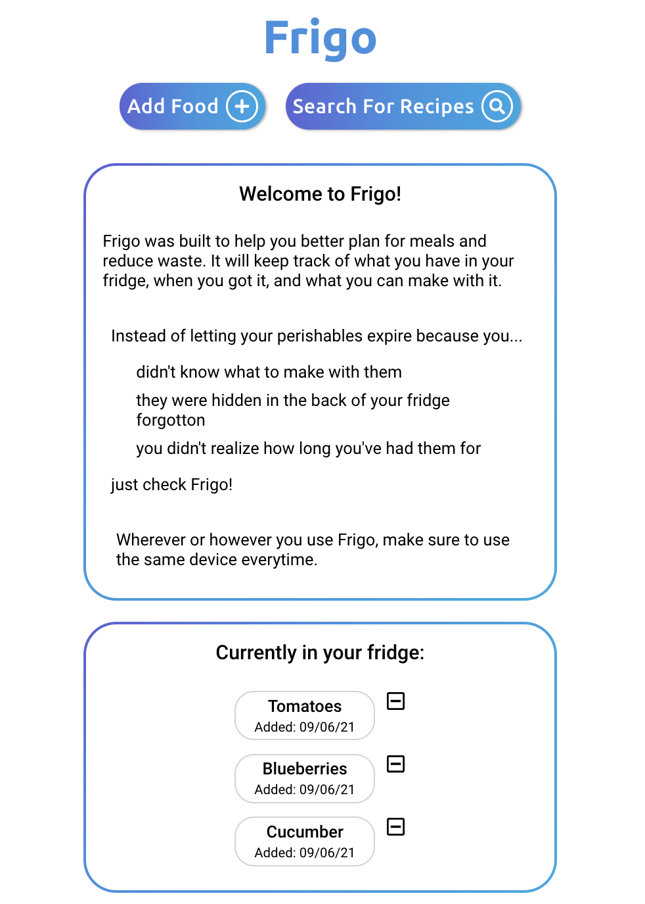
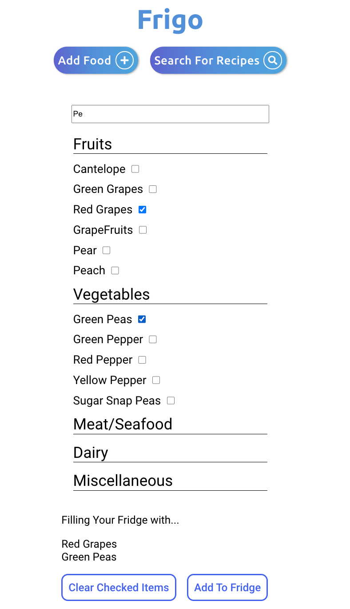
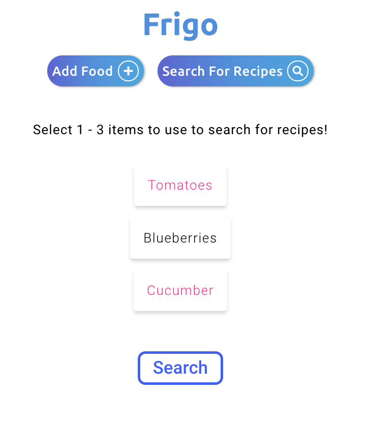
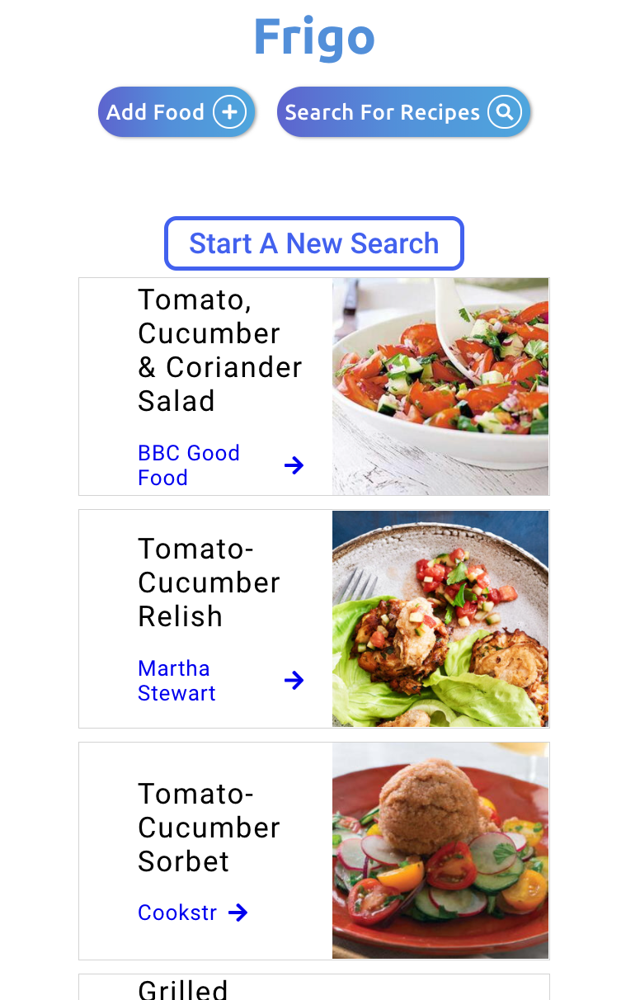

# Frigo (*free-goh*)

[Live App](https://frigo-food.vercel.app)

An application built to help reduce food waste by keeping track of what perishables are currently in the users fridge, and when they were purchased. A recipe search function is also included for users that need inspriation to use what they currently have.

Landing Page:

Add food page:

Recipe search page:

Recipe search results:

Built using React, CSS3, and FontAwesome icons.